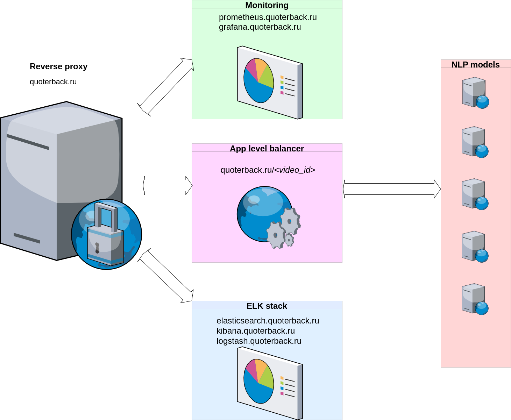

# Overview
This is the sentiment estimator of youtube videos comments distributed across multiple nodes. The idea of distributed sentiment estimation is intended to maximize the response speed.

# Workflow
The general workflow is as follows:   
1) the **reverse proxy** gets request of form *quoterback.ru/video_id* (where *video_id* could be extracted from the  web address of the video like that ) and send it to the **app level balancer**; 
2) the task of the **app level balancer** is to request comments from the video web page and split them evenly between the nodes with NLP sentiment analysis model deployed on each of the node (the code of the balancer is [here](https://github.com/Quotermain/app_level_balancer)); 
3) the final step is sending response containing text of each comment with corresponding sentiment assessment back to a client (the code of the NLP model nodes is [here](https://github.com/Quotermain/sentiment_analysis_backend_server)) 

The state of all nodes could be observed via the ELK and the prometheus-grafana stack (the schema is depicted below). 

All roles for provisioning are [here](https://github.com/Quotermain/sentiment_roles/tree/main/roles).  

